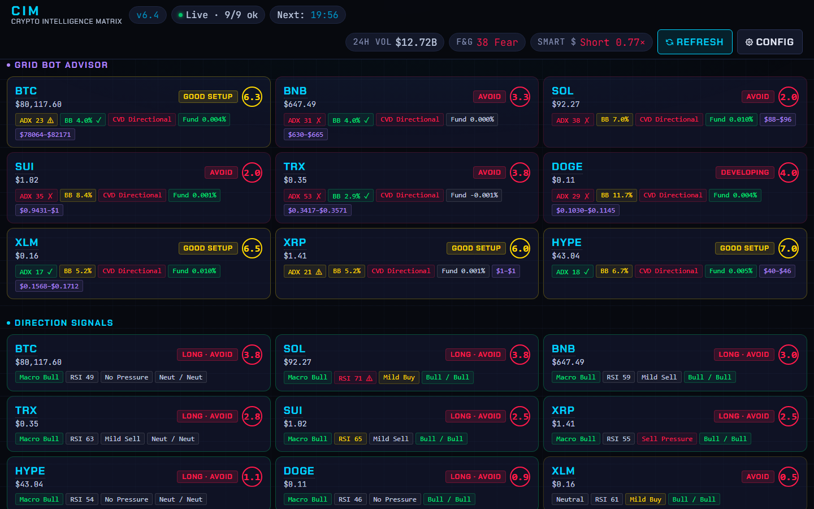
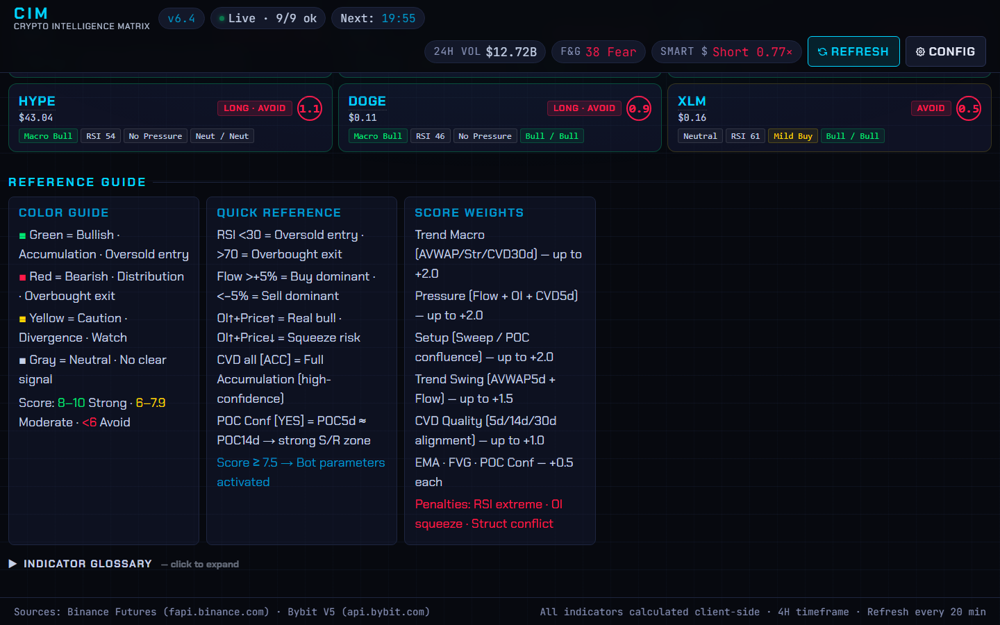
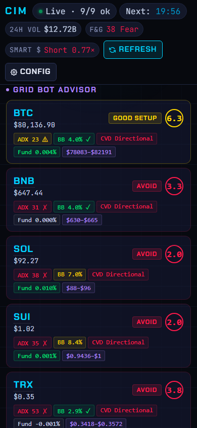

# CIM — Crypto Intelligence Matrix `v6.2`

**Live:** [pioniex.vercel.app](https://pioniex.vercel.app/)

Real-time crypto futures dashboard. Pulls live market data from Binance Futures and Bybit V5, runs all technical analysis in the browser, and scores each asset 0–10 to surface high-probability 4H setups. No backend. No API keys. No build step.

---

## Screenshots

### Dashboard — Fast Decision Table


### Signal Cards & Grid Bot Advisor


### Mobile View


---

## What it does

You open the dashboard and see a table of crypto futures ranked by signal score. Each row shows: price, RSI, funding rate, order flow bias, market structure, and a composite score (0–10). Click any row to expand a deep card with full indicator breakdown, score components, and — if the score is high enough — ready-to-use bot parameters.

Below the decision table sits the **Grid Bot Advisor**: ATR-derived grid ranges, grid count, profit-per-grid, worst-case drawdown, and SL/TP levels for each tracked symbol.

**Signal color system:** green = bullish, red = bearish, yellow = caution/divergence, gray = neutral.

---

## Features

| Feature | Description |
|---------|-------------|
| **Market Pulse topbar** | Live pills: 24h Volume · Fear & Greed (alternative.me) · Smart Money (Binance top-trader L/S ratio) |
| **Fast Decision Table** | Quick signal overview — click any row to expand a deep analysis card |
| **Deep Card** | 4 indicator groups (Trend · Momentum · Volatility · Setup) + score breakdown + direction checklist |
| **Score Engine (0–10)** | Weighted composite score; ≥ 7.5 activates bot parameters |
| **Bot Parameters** | Entry, SL, TP1/TP2, leverage, position size, R:R — auto-calculated per asset |
| **Grid Bot Advisor** | Per-ticker spot grid setup: ATR-based range, grid count, net profit/grid, drawdown, SL/TP |
| **Full Metrics Table** | 15 key columns by default; toggle to show all 25 (price · funding · RSI · ATR · flow% · POC · AVWAP · CVD · OI · structure · EMA · FVG) |
| **Symbol Manager** | Add/remove tickers at runtime — validated against Binance/Bybit, persisted in localStorage |
| **Auto-refresh** | Fetches every 20 minutes; countdown timer in topbar |
| **Responsive** | 4K (1440px max) down to 480px mobile |

---

## Quick Start

ES Modules require HTTP — `file://` won't work.

```bash
# Python (no install required)
python -m http.server 8080

# Node
npx serve .
```

Open `http://localhost:8080/`.

Deployed on Vercel — pushes to `master` auto-deploy. No CI, no tests, no build step needed.

---

## Project Structure

```
├── index.html          # Page skeleton — HTML only, no inline JS/CSS
├── css/
│   └── style.css       # All styles — CSS variables, responsive breakpoints
└── js/
    ├── config.js       # CFG + GRID_CONFIG constants, API base URLs, localStorage helpers
    ├── api.js          # tryFetch, Binance/Bybit endpoints, unified fetch wrappers
    ├── indicators.js   # All calculations: RSI/ATR/EMA/POC/AVWAP/CVD/FVG + calcScore + calcBotParams
    ├── ui.js           # DOM string builders: buildTableRow, buildDeepCard, buildBotCard, renderGridPanel
    ├── grid.js         # Grid bot math — pure functions, no side effects
    └── app.js          # State, orchestration, event handlers, init
```

Module dependency graph (no circular dependencies):

```
index.html
  └── css/style.css
  └── js/app.js
        ├── js/config.js
        ├── js/grid.js         (pure — no imports)
        ├── js/api.js          → config.js
        ├── js/indicators.js   → config.js, api.js
        └── js/ui.js           → config.js, indicators.js
```

---

## Data Sources

| Source | Used for |
|--------|----------|
| `fapi.binance.com` | Price, funding rate, klines, open interest (primary) |
| `api.bybit.com/v5` | All of the above (fallback when Binance fails) |

No API keys required — all public market data endpoints.

---

## Indicators

| Indicator | Timeframe | Notes |
|-----------|-----------|-------|
| RSI | 4H × 210 candles | 14-period |
| ATR | 4H | 14-period; drives SL/TP sizing |
| EMA 50 / 200 | 4H | Golden/death cross detection |
| POC + AVWAP | 5d / 14d / 30d | Volume-profile point of control + anchored VWAP |
| CVD | 5d / 14d / 30d | Cumulative Volume Delta — accumulation vs. distribution |
| Market Structure | 4H / 30d | HH+HL = Bullish · LH+LL = Bearish |
| FVG | Last 100 × 4H | Up to 5 intact fair value gaps, sorted by proximity |
| Flow% 24h | 1H × 24 | (BuyVol − SellVol) / TotalVol |
| Open Interest | 4H × 42 | 7-day % change used for scoring |
| Volume Spike | 4H | Current vs. 20-candle average; ≥ 2× = spike |
| Liquidity Sweep | Latest 4H | Compares against all-time high/low of prior candles |

---

## Scoring

Scores range **0–10**. Score ≥ 7.5 activates bot parameters.

| Component | Max Points |
|-----------|-----------|
| Trend Macro (AVWAP14d/30d + Structure30d + CVD30d) | +2.0 |
| Pressure (Flow + OI change + CVD5d) | +2.0 |
| Setup (Sweep / POC confluence / FVG entry) | +2.0 |
| Trend Swing (AVWAP5d + CVD5d + Flow) | +1.5 |
| CVD Quality (5d/14d/30d alignment) | +1.0 |
| EMA alignment | +0.5 |
| FVG proximity | +0.5 |
| POC Confluence (5d ≈ 14d) | +0.5 |

**Penalties:** RSI extreme (−0.5) · OI squeeze on short (−0.5 to −1.0) · Structure timeframe conflict (−0.5)

**Thresholds:** ≥ 7.5 = bot active · 6–7.4 = developing · < 6 = avoid

---

## Bot Parameters

Activated when score ≥ 7.5.

| Parameter | Formula |
|-----------|---------|
| Entry | FVG top/bottom near price, else current price |
| Stop Loss | Entry ± 1.5 × ATR4H |
| Take Profit 1 | Entry ± 3.0 × ATR4H (close 50%, move SL to breakeven) |
| Take Profit 2 | Entry ± 5.25 × ATR4H (trail remaining 50%) |
| Leverage | ≥ 9.5 → 6× · ≥ 9.0 → 5× · ≥ 8.5 → 4× · ≥ 8.0 → 3× · ≥ 7.5 → 2× |

---

## Configuration

All parameters in `js/config.js` under the `CFG` object:

```js
REFRESH_INTERVAL_SEC : 1200   // 20 minutes
SCORE_BOT_MIN        : 7.5    // minimum score to activate bot params
RSI_OB / RSI_OS      : 70 / 30
FLOW_STRONG          : 5.0    // % threshold for strong buy/sell flow
SL_ATR_MULT          : 1.5
TP1_ATR_MULT         : 3.0
TP2_ATR_MULT         : 5.25
```

Grid bot parameters in `GRID_CONFIG`:

```js
DEFAULT_CAPITAL        : 500    // USDT per session (overridable via Config modal)
FEE_PCT                : 0.001  // 0.1% per side (0.2% round-trip per grid)
TARGET_NET_PCT         : 0.006  // 0.6% target net profit per grid
ATR_MULTIPLIER_DEFAULT : 2.5    // range = price ± (ATR% × multiplier)
GEOMETRIC_THRESHOLD_PCT: 20     // use Geometric mode when range ≥ 20%
```

Default symbols: BTC, ETH, BNB, SOL, TRX, SUI, HYPE — all editable at runtime via the Config modal, persisted in localStorage.

---

## Browser Requirements

Any modern browser with ES Module support: Chrome 61+, Firefox 60+, Safari 11+, Edge 79+. Must be served over HTTP — `file://` is not supported.

---

## Changelog

### v6.2 — 2026-05-08
- Version badge updated to v6.2

### v5.4 — 2026-04-02
- Signal Analysis section removed — signals surfaced inside each Grid Bot card as compact "Active Signals" strip (Setup · Bot Grid · Presiune)
- Grid Bot Advisor promoted above Full Metrics table
- Contextual subtitles added to Fast Decision and Grid Bot sections
- TradingView links on symbol names in Fast Decision table
- Grid risk tightening — stricter ADX/structure viability thresholds
- Incremental ticker rendering — renders as data arrives, not after full batch

### v5.2 — 2026-03-22
- Visual polish: signal edge bars, favicon, max-width layout
- Deep card: 4 indicator groups + score breakdown table

### v5.1 — 2026-03-15
- CIM rebrand, Market Pulse topbar pills (Fear & Greed · Smart Money · 24h Volume)
- Responsive layout and topbar

### v5.0 — 2026-03-10
- Deep card UX polish, compact score table, initial v5 architecture

---

## License

MIT
